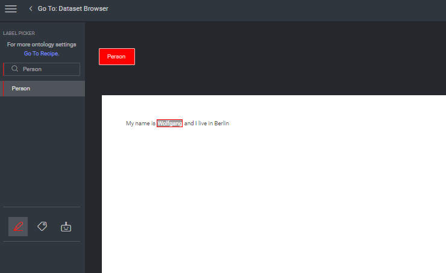

# Text Item

To annotate text file by word or sentence you can use the `dl.Text` annotation.
It uses start and end character location to label specific word, sentence or any other text block in the txt file.

Here's a simple code example to upload a `Person` label to a name in the txt:

```python
# Get dataset, project and item from the platform
import dtlpy as dl

project = dl.projects.get('My Project')
dataset = project.datasets.get('My Dataset')
item = dataset.items.get(filepath='/your-text-file-path.txt')
# Create a builder instance
builder = item.annotations.builder()
builder.add(annotation_definition=dl.Text(text_type='block',
                                          start=11,
                                          end=19,
                                          label='Person'))
# Upload classification to the item
item.annotations.upload(builder)
```

When you open the item in the studio, the word will be annotated with the `Person` class:


