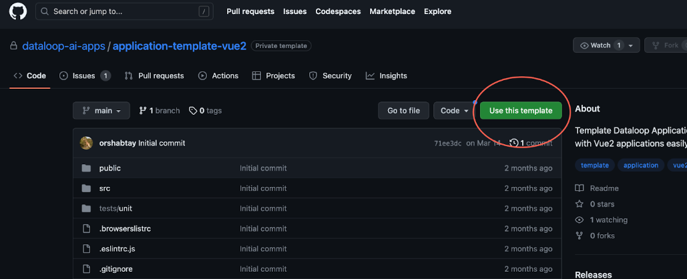

# Vue.js based Single Page Application

## Tl;dr


1. Create a client-side app using the framework of your choice. Use our JS SDK to work with Dataloop entities.
2. Serve dataloop.json on the root of your application.
3. Serve this application on your local server on the local.dataloop.ai domain over HTTPS.
4. Open console.dataloop.ai and go to FaaS/Application Hub. Go to the Developer tab and click on  +Add Debug App  .
5. Fill out the form and choose the type of your panel. eg: Item Viewer.
6. Go to the screen where your panel is used and trigger your panel and test the application.
7. Use the Browser console and Network tab to debug the application.

## Too Short; Want More?

A single page application for dataloop platform can be created by utilising various UI panel slots. For this tutorial, we will be focussing on the “Item Viewer” panel.

We prefer Vue.js for our application development because we have an open source design-system and icons library that matches our platform’s theme.

To get started, go to this [template repo](https://github.com/dataloop-ai-apps/application-template-vue2) and click on the `Use this template` button.



### Local Configurations
For working on a dev/local environment, you will need to add local.dataloop.ai to your hosts file.
1. Open your hosts file with admin/sudo privileges. This is normally in /etc/hosts on Linux, C:\Windows\System32\drivers\etc\hosts on Windows.
2. Add the following  lines to the end of the file:
```text
# dataloop local
127.0.0.1 local.dataloop.ai
```
3. You might also need to run your app in https mode.
4. You may need to enable [CORS](https://developer.mozilla.org/en-US/docs/Web/HTTP/CORS) on your app.
5. Your app should be up running in the browser.
   1. NOTE: In Windows you need to serve the app at "0.0.0.0" (otherwise it may not work on the local.dataloop.ai host)
6. Your app should have a manifest file - dataloop.json - it needs to be publicly served under the app's main address (For example: https://local.dataloop.ai:3000/dataloop.json ).
7. You're going to need a working, functioning Dataloop Platform user with a Developer role.
8. You're going to need to be familiar with our Javascript SDK

### The Dataloop Package Source Code
Now we will create the app files and directories:

1. Create a new repo and then clone the newly created repo to your local and move to the downloaded folder.
2. Install all the dependencies
```shell
npm i
```
3. Run the application locally:
```shell
npm run serve
```
4. This should run the server locally using vue tools on https://local.dataloop.ai on 8080 (or any other following available port) port.
5. Open the url in the browser.
   1. If you're getting the "Not Private" message allow the locally generated https certificate in your browser by clicking the `Proceed to local.dataloop.ai` link or by type `thisisunsafe`


Here in our code we are creating an Item Viewer, so we need to load an item.
Remember, this application would be used inside the dataloop platform to view an item, so your iframe would get access to the item using the [Dataloop JS SDK](https://developers-dev.redoc.ly/resources/dtljs/).

Now we can use Dataloop JS SDK and component library to load an item.
In the template provided to you, we have already initialized the Dataloop SDK along with its theme variable and Item details.
So, this template already contains the code that is needed to view an item.

If you check the App.vue file, the item is loaded using:

```js
public async getItemDetails() {
   this.item = await this.dl.items.get()
   this.stream = await this.dl.items.stream(this.item?.stream)
}
```

The `get` function without the item id or name loads the current item.

And, the following part of the template will showcase the item to the user:
```html

```

So, now the app is running and should be loading an item once it is inside the dataloop platform.

The next step would be running this app on the debug mode and then publishing it.

## Debug App in the Dataloop Platform

* On the left sidebar menu, go to **Application Hub** under the **Application (FAAS)** section, and open the **
  Developer** tab.
  
* Click the **Add Function** button.
* Fill out the name of the app, choose a main slot and add your application's URL address
    - (For example: https://local.dataloop.ai:3000)
      
* Press the **Create** button, and wallah! You have a debug app in the Platform.
  
* Go to the dataset browser, right-click on an item, _Open With..._ and choose your
  app! <br /><p><br /></p>

### Tests

In order to run tests locally, you must mock the `dl` xFrame Driver and provide it with mock data. We created
a `DlMockDriver` and a **Debug Snapshot** shortcut exactly for that!

- The `DlMockDriver` is a mock driver that simulates the `dl` xFrame Driver, and is used for testing applications
  locally.
    - You can mock the `window.dl` during testing by assigning a new instance of `DlMockDriver` to `global.window.dl`,
      effectively overriding its original value.

* In order to get the mock data for the mock driver, you can use the **Debug Snapshot** feature.
    - [Add a debug app to the Platform](index.md#How to add a debug app in the Dataloop Platform).
    - Press the **Debug Snapshot** icon at the top bar (or **Alt+Shift+S**) in order to download the generated
      snapshot file.
    - Place the file in your tests directory.
    - Require the snapshot file in your test file, and use it to create a new instance of `DlMockDriver`.

```typescript
import { DlMockDriver } from '@dataloop/jssdk'

const data = require('./snapshot.json')
global.window.dl = new DlMockDriver(data)
```

## Item Viewer Example

For a full working item viewer, check out [this repo!](https://github.com/dataloop-ai-apps/item-viewer)
