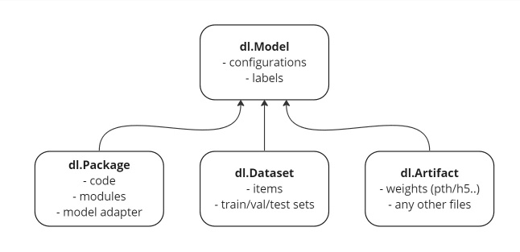

# Model Management  
  
## Quick overview  
Dataloop's model management centralizes model research and production processes for machine learning engineers in one place.  
  
Models can be installed from pre-trained open source model architectures (e.g.ResNet, YOLO). These models can also be fine-tuned on custom datasets on the Dataloop platform.  
  
You can also upload your own models and compare model performance through the model metrics interface.  
  
  
## Introduction  
  
In this tutorial we will cover the required Dataloop entities to create, compare, restore, manage, and deploy model training sessions and trained models.  
  
  
  
  
### DPK, Apps and Model Entities  
  
#### DPK  
  
We will use the DPK entity to save the architecture of the model (e.g Yolov8, Inception, SVM, etc.) and any other function and modules.  
  
- The DPK code should include a Model Adapter to create the Dataloop API  
  
Models that are ready as-is to use can be found in the Market Place. All models listed in the Market Place are pretrained and include the model architecture code and default configurations.  
  
#### Apps  
Once the app is installed, it will clone the pretrained model into the project  
  
#### Model  
  
Using the App (code), Dataset and Ontology (data and labels) and configuration (a dictionary) we can now create a Model.  
  
The Model contains the weights and any other artifacts needed to load the trained model and inference.  
  
A Model can also be cloned to be a starting point for a new model (for fine-tuning or transfer learning).  
  
### Additional Components  
  
Some users may want to further customize their models, such as uploading their own model weights or creating their own custom model. This can be achieved with Artifacts and a Model Adapter.  
  
#### Artifacts and Codebase  
  
Artifacts are any additional files necessary for a given model to run on the cloud. For example, if a user wanted to upload their own weights to create a pre-trained model, the weights file would be included as an Artifact.  
Artifacts can be uploaded from a local path (`model.artifacts.upload()`) or they can point to a remote link somewhere (`dl.LinkArtifact`)  
  
#### The Model adapter  
  
The model adapter is a python class that creates a single API between Dataloop's platform and your model. The ModelAdapter class contains standardized methods that make it possible to integrate models into other parts of the Dataloop platform. Model adapters allow the following model functions:  
1. train  
2. predict  
3. load/save model weights  
4. annotation conversion (if needed)  
  
### Model comparison  
  
All models can be viewed in one place, and different model versions can be compared and evaluated with user-selected metrics.  
  
  
  
